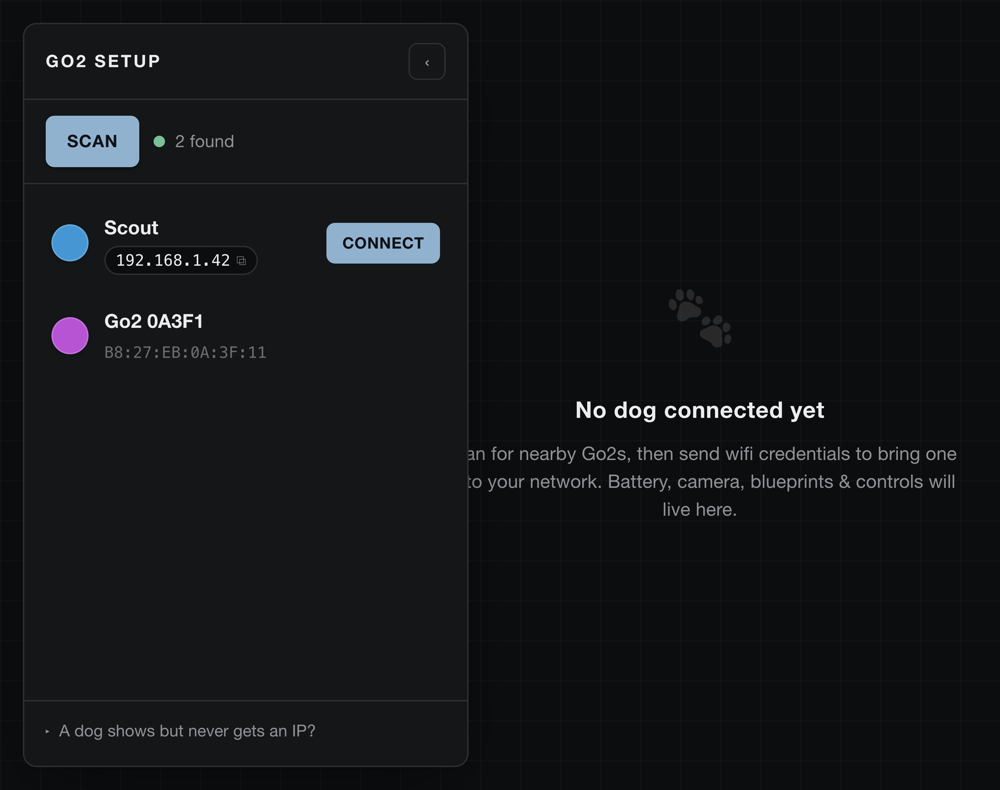
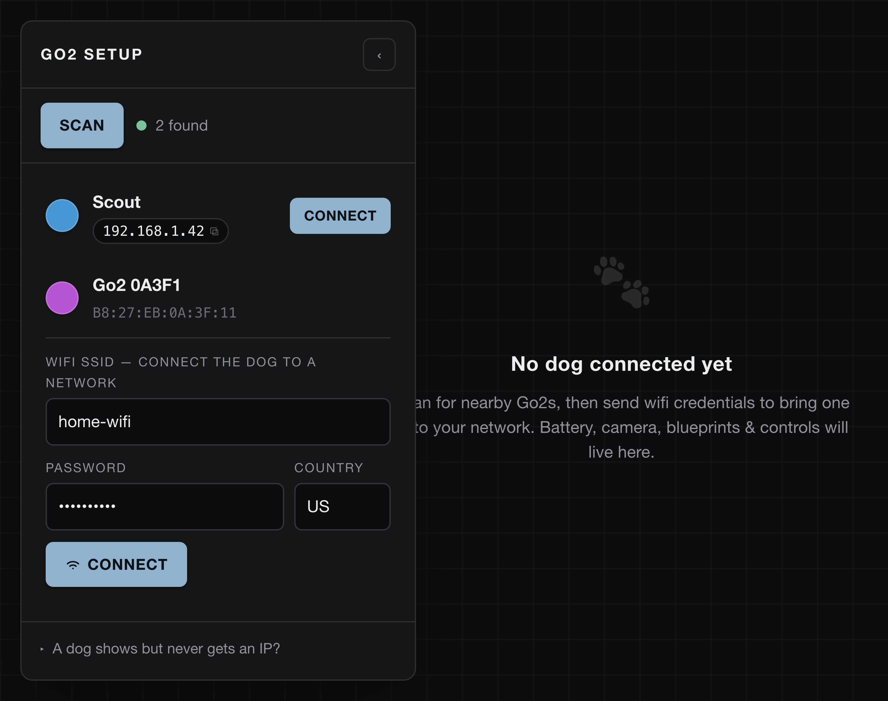

# dim-go2-dash

A [DimOS dashboard](https://github.com/jeff-hykin/dim-app) app for discovering and
provisioning **Unitree Go2** robots.

- **Discover** nearby Go2s over Bluetooth (BLE) and on the local network (LAN).
  When a robot is seen on both, its rows merge so you get its name, serial *and*
  IP in one card.
- **Connect to wifi** — click a discovered Go2 and send it wifi credentials over
  Bluetooth, so it joins your network.

It's a side panel that slides away once a dog is connected, leaving the stage for
the per-dog dashboard to come (battery, camera, blueprints, keyboard controls, …).

| Discover | Connect to Wi-Fi |
| --- | --- |
|  |  |

## How it works

BLE scanning and the wifi handshake both need native Bluetooth (CoreBluetooth on
macOS, BlueZ on Linux), so this can't be pure Deno. The backend (`main.js`) uses
`nix run` to build and launch a standalone **Rust helper** (`go2_helper_rs`) that
does BLE discovery, LAN/ARP discovery, and wifi provisioning, and speaks
newline-JSON over stdio. The dashboard pipes that to/from the browser panel over
the app-bus. No dimos venv is required — `nix` builds the helper on first launch
(cached thereafter) and it runs on both macOS and Linux.

## Install

```sh
dim install https://github.com/jeff-hykin/dim-go2-dash
```

The app appears in the dashboard rail within a few seconds.

## Layout

```
dim/apps/go2_dash/
  app.json        title
  icon.svg        rail icon
  index.html      the panel (frontend)
  main.js         backend — nix-runs the Rust helper, relays over the app-bus
  go2_helper_rs/  Rust helper — BLE + LAN/ARP discovery + wifi provisioning
    flake.nix     builds the helper (native + linux-musl cross), run via nix
    src/          protocol, ble, lan, arp, discovery, main
```

Licensed under Apache-2.0.
