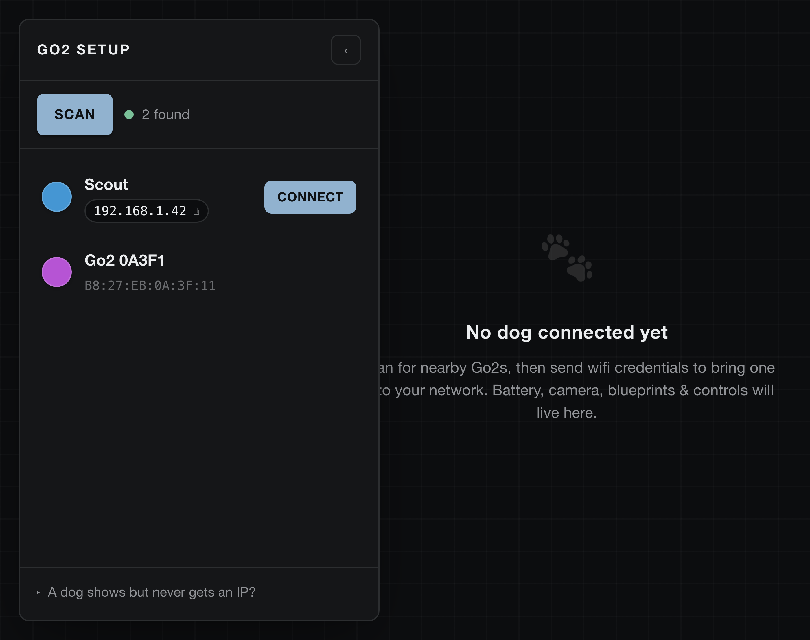
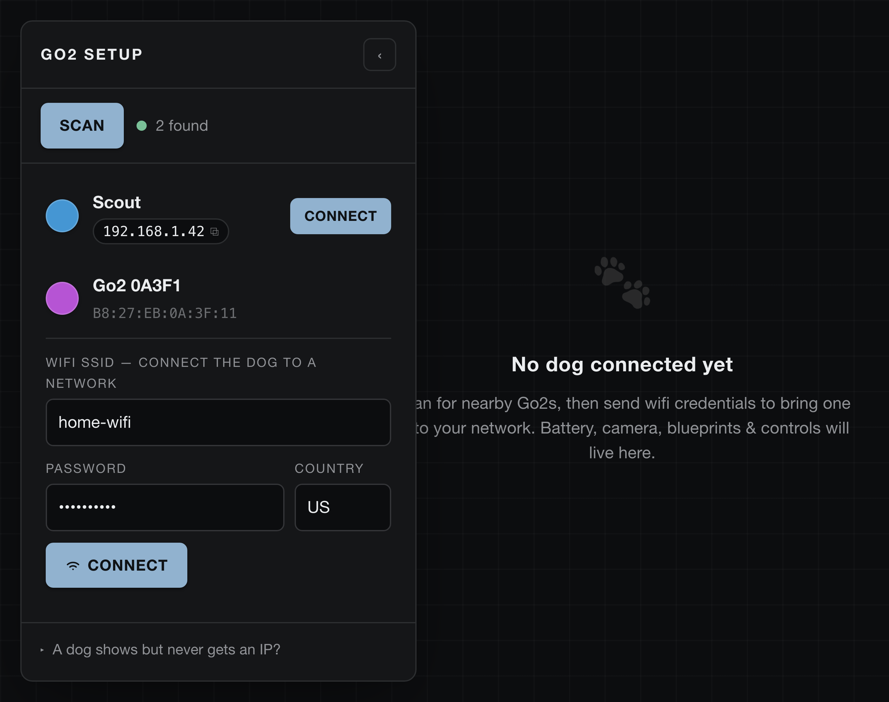

# Go2 Ctrl (dim-go2-dash)

A [dimOS Desktop](https://github.com/dimensionalOS/dimos-desktop) app for **Unitree Go2** robot dogs:

- **Discover** nearby Go2s over Bluetooth (BLE) and on the local network (LAN + ARP). A robot seen both ways is one
  card with its name, serial and IP. Where the Wi-Fi drops LAN discovery's multicast (offices), an ARP sweep (one
  unprivileged ping per address) finds the IP: joined to Bluetooth by MAC on Linux (Wi-Fi MAC = Bluetooth MAC − 1);
  macOS hides Bluetooth MACs, so there a Unitree MAC prefix alone marks it (best effort). Try it from a terminal:
  `cd backend && cargo run --example find_go2 -- full`.
- **Connect to Wi-Fi**: send a Go2 Wi-Fi credentials over Bluetooth so it joins your network.
- **Drive** one live: camera, stand / sit / jump / dance / …, and keyboard, d-pad or gamepad walking, over WebRTC.
  Gamepad (the Steam Deck under Steam, Xbox, PlayStation: the standard mapping): left stick walk + strafe, right
  stick turn, RB run, LT + RT or B = STOP (holds until A), hold B 1 s = **Sit down** (stop, then StandDown; also a
  button). A pad drives nothing until its sticks have been at rest; blur, a hidden page or a disconnect zero it.
- **Record** the session in Desktop's recordings folder (`go2/<date>_<time>_<dog>_<machine id>.db`). By default a
  dimos memory store: the SQLite layout dimos' `SqliteStore` reads, dimos' LCM types per stream (`backend/src/msg.rs`
  lists them), so `SqliteStore(path=…)`, `store.replay()` and the Go2 replay connection open it. Or, picked in Record
  options (or the `db`/`mcap` toggle bottom-left of Control), an mcap of ROS2 CDR with ros2msg schemas like
  Controller's recorder: `/color_image` (JPEG CompressedImage), `/camera_info`, `/lidar`
  (PointCloud2, the dog's local voxel window), `/odom` (PoseStamped), `/tf`, `/imu`, `/battery`, `/joint_states`,
  `/joystick` (sensor_msgs/Joy: the RAW pad axes and buttons, layout in the channel metadata, never velocities),
  `/cmd_vel` (the Twist actually sent) and `/commands`. A commit (.db) or a closed zstd chunk (mcap) every second
  and a byte-capped queue: a killed run keeps all but its last second (and is finished on the next start), memory
  stays flat.
- **Go2 hotspot (AP mode)**: Scan also lists Wi-Fi hotspots named like a Go2's (`GO2-…`, `Go2_…`, `Unitree…`);
  "Connect via hotspot" asks first, switches this computer's Wi-Fi to it (NetworkManager on Linux / SteamOS,
  `networksetup` on macOS, where the hotspot's name is typed since macOS hides Wi-Fi names from apps), drives the dog
  at 192.168.12.1, and a banner switches back. Hotspot passwords are saved per hotspot (0600, the app's data dir).
- **Recordings**: this app's recordings, newest first; Upload (through Desktop's upload queue), Open in Recordings,
  Rename, Delete, Cancel upload; Auto-upload (off by default) retries failures and waits while offline.

| Discover | Connect to Wi-Fi |
| --- | --- |
|  |  |

## Every action is an endpoint

The backend does everything (scans, provisioning, the robot's WebRTC session); the page and Desktop's agent call the
same HTTP endpoints, listed in `dimos.yaml` (`agent:`) and served as `agent.json`. A few:

| | |
| --- | --- |
| `POST api/scan` | scan (Bluetooth + LAN), answers with the robots found |
| `POST api/robots/{key}/wifi` | put a robot on Wi-Fi over Bluetooth |
| `POST api/drive/connect` | open the live session to a robot |
| `POST api/drive/jump`, `…/stand`, `…/sit`, `…/dance1`, … | robot commands |
| `POST api/drive/move` | walk at a velocity for a while |
| `GET api/state` | everything at once |

Robot-moving and Wi-Fi-changing endpoints take `dryRun: true` (check and say what would be sent, send nothing);
`POST api/drive/connect` with `dryRun: true` opens a simulated session. `GO2_DASH_MOCK=1` simulates every robot,
Bluetooth and cloud interaction.

## Layout

```
backend/    Rust (Bluetooth via CoreBluetooth/BlueZ, WebRTC to the robot), axum server → dimos-app-server
  src/routes.rs     every endpoint        src/drive.rs      live session + commands
  src/app.rs        state, scan, Wi-Fi    src/robot_rtc.rs  the Go2 WebRTC handshake
  src/ble.rs …      discovery/provisioning (BLE, LAN, ARP)   src/video.rs  camera → pages
  tests/routes.rs   each route, happy path + error (mock app)
frontend/   TypeScript + Vite + React
flake.nix   nix build .#dimosApp → bin/dimos-app-server
```

Develop: `cd backend && GO2_DASH_MOCK=1 cargo run -- --port 8787 --frontend ../frontend/dist` and
`cd frontend && npm run dev`. Checks: `cargo test`, `npm run typecheck`, `deno task check-endpoints`
(`--write` regenerates `dimos.yaml`'s `agent:`).

## Install

```sh
dimos-desktop install https://github.com/jeff-hykin/dim-go2-dash
```

Licensed under Apache-2.0.

Recording starts automatically after a dog connects and ends on disconnect. Auto-upload is enabled by default;
it can be disabled in recording options or the recordings list. The red Record button has an options menu for
folder, stream selection, per-stream max rates, camera JPEG/raw encoding, chunk compression, and session logs.
Action presses are ROS2 `std_msgs/msg/String` JSON messages on `/robot_action`; raw controller input is
`sensor_msgs/msg/Joy` on `/joystick`, and sent velocities remain on `/cmd_vel`. Hold LT or RB to walk fast.
